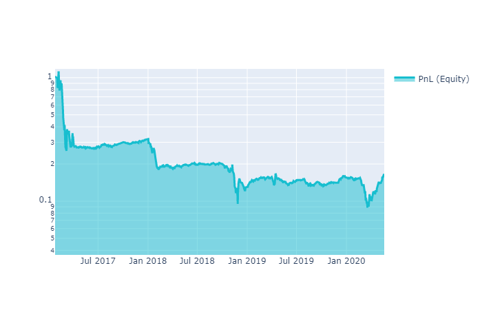

# Creating first strategy

Below are basics steps that might be included in each strategy.
## 1. Preparations
At first one needs to prepare the workspace - load data and libraries
```python
# Import basic libraries.
import xarray as xr
import numpy as np
import pandas as pd

# Import quantnet libraries.
import qnt.data    as qndata
import qnt.stepper as qnstepper
import qnt.stats   as qnstats
import qnt.graph   as qngraph
import qnt.forward_looking as qnfl # forward looking checking
```
```python
# load historical data
data = qndata.load_data(min_date = "2017-01-01",
                        max_date = None,
                        dims     = ("time", "field", "asset"))
```

"data" is xarray.DataArray that contains stocks historical data. For instance, we want Apple stock open and close prices:

```python
apple_close = data.loc[::, "close", "NASDAQ:AAPL"]
apple_open = data.loc[::, "open", "NASDAQ:AAPL"]

# you can also work with pandas:
# apple_close = data.loc[::, "close", :].to_pandas()["NASDAQ:AAPL"]
```

Available data explanation is here. Some other data:
```python
all_close = data.loc[::, "close", :]
all_open = data.loc[::, "open", :]

# boolean parameter. True if the stock is in top 500 most liquid stocks over the last month
liquid = data.loc[::, "is_liquid", :]
```

## 2. Weights allocation
Suppose, we have a trading idea - invest more if open price is low. This hypothesis can be expressed through the formula:

```math
\frac{1}{open}
```

We can allocate capital by assigning weights to the portfolio instruments ([read more](/data/market.md)):
```python
weights = 1/all_open
```

You can implement and test any idea you want. Some other examples:
```python
# buy all positions: weights = all_open/all_open
# sell all positions: weights = -all_open/all_open
# the more price change, the more we buy = (all_close - all_open)/all_open
```

Notice that we trade only liquid stocks. One can form output weights:

```python
output = weights*liquid


# If you worked with pandas and weigths is pandas.Dataframe:
# output = xr.DataArray(weights.values, dims = ["time","asset"], coords= {"time":weights.index,"asset":weights.columns} )
```


## 3. Perfomance estimation
Once we have constructed an algorithm we need to evaluate it. At first, we need to calculate statistic.
```python
# calc_stat calculate statistic on a relevenat time frame window
stat = qnstats.calc_stat(data, output)
display(stat.to_pandas().tail())
```
Algorithm results, calculated on historical data, are usually presented on an [equity graph](/intro/rr.md) in order to understand the behavior of the cumulative profit:

```python
# show plot with profit and losses:
performance = stat.to_pandas()["equity"]
qngraph.make_plot_filled(performance.index, performance, name="PnL (Equity)", type="log")
```



We use a set of criteria to [evaluate](/quality/rules.md) evaluate the performance. 
You can submit your algorithm and take part in a competition if it passes all the [requirements](/quality/major.md).

```python
# Actual sharpe on a relevant timeframe. 
# According to the rules the Sharpe ratio must be greater than 1:
display(stat[-1:].sel(field = ["sharpe_ratio"]).transpose().to_pandas())

# According to the rules the correlation with other strategies must be less than 90%:
qnstats.print_correlation(output, data)
```


## 4. Submit

If you are satisfied enough with your algorithm and it passes all the requirements you can submit it.
```python
# Finally, write the output
qnstepper.write_output(output)
```

At this stage the code is ready for submission. Just click on the submission button in your account page and we will evaluate your strategy live on our servers!