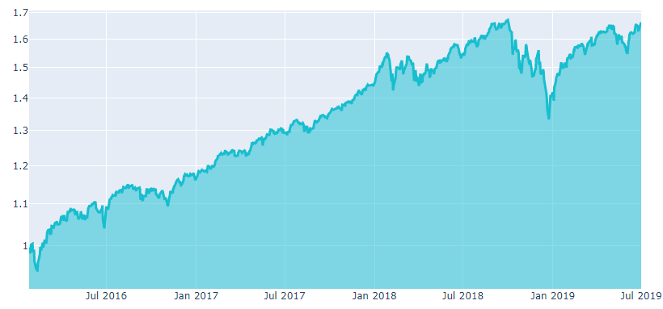
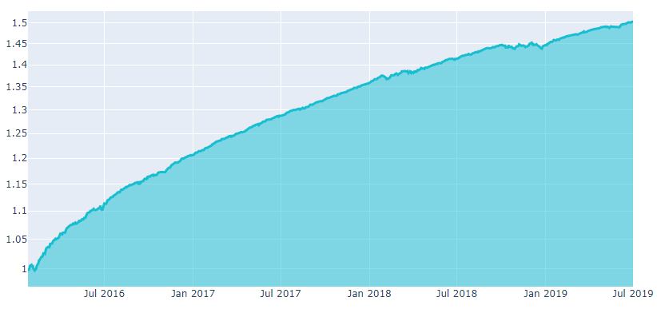

# Sharpe Ratio

## Basic information
First, to estimate the profitability of the algorithm, we measure the Sharpe ratio (SR), the most important and popular metric. For our platform, we use the annualized SR and assume that there is ≈252 trading days on average per year. The annual SR formula for N days is presented below:

```math
\label{SR_final_first}
    \text{SR} = \frac{\sqrt[N]{[\prod\limits_{i=1}^{N} (rr_i + 1)]^{252}} - 1}{\sqrt{\frac{252}{N}\sum\limits_{i=1}^{N} (rr_{i}  - \overline{rr}) }},
```

where ``$` rr_i `$`` stands for the daily relative returns (of the i'th day),
``$`\overline{rr}`$`` denotes the expected value.

The numerator is an average daily return. The book size changes with the size of equity, thus the numerator is a geometric mean.

The denominator is a standard deviation of the portfolio’s excess return. Another way to think about the denominator is that it means volatility.

Thus, the Sharpe ratio is the return per unit of risk (volatility). The greater the Sharpe ratio, the better (Fig.2). To submit a strategy successfully, the SR should be higher than 1 over the last 3 years.



Figure 2: Equity charts for different algorithms. Upper: ``$` \text{SR} = 1.28 `$``.
Lower: ``$` \text{SR} = 7.62 `$``


# Details

In 1994, William Sharpe defined the Sharpe ratio as:

```math
\label{SR_1}
    \text{SR} = \frac{E(R_p - R_f)}{\sigma_p},
```
    
where ``$` R_p `$`` - return of the portfolio
, ``$` R_f `$`` - risk-free rate, ``$` E(R_p - R_f) `$`` - s the expected value of the excess of the portfolio return over the benchmark return,
``$` \sigma_p `$`` - standard deviation of the portfolio's excess return. We
assume risk-free rate to be zero (alternative way to compute the Sharpe ratio is to set S&P 500 total return as a risk-free rate). For N trading days:
 
```math
 \label{SR_2}
    \text{SR} = \frac{\text{average daily return}}{\text{daily volatility}} = \frac{\sqrt[N]{\prod\limits_{i=1}^{N} (rr_i + 1)} - 1}{\sqrt{\frac{1}{N}\sum\limits_{i=1}^{N} (rr_{i}  - \overline{rr}) }},
```

where ``$` \overline{rr} `$`` - denotes the expected value of relative returns. The book size changes with the size of equity, thus the numerator is a geometric mean. Now we introduce the SR, scaled on an arbitrary period ``$` T `$``:

```math
\label{SR_final}
    \text{SR} = \frac{\sqrt[N]{[\prod\limits_{i=1}^{N} (rr_i + 1)]^T} - 1}{\sqrt{\frac{T}{N}\sum\limits_{i=1}^{N} (rr_{i}  - \overline{rr}) }}.
```

For annual Sharpe ratio one can put T= 252 - trading days per year. We use annual (T= 252) Sharpe ratio (11) to estimate algorithms on our platform.