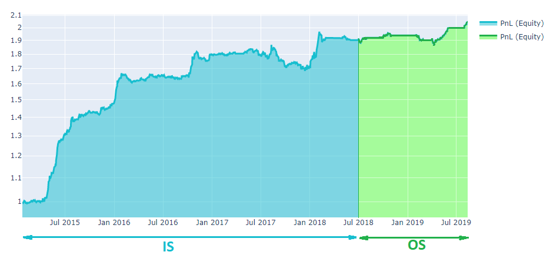

# Основные положения о соревнованиях
## Выплата призов
    
* Выплата призов производится перечислением средств на расчетные счета один раз в квартал. 4 раза в году.
* Мы уплачиваем за вас подоходный налог, если вы гражданин РФ.
* С победителями связываемся по электронному адресу указанному при регистрации.
* Стратегии проверяются на использование нечестного преимущества.
* Результаты соревнований публикуются в течении двух рабочих недель, каждого месяца.
* Стратегии могут быть отфильтрованы в периоде на котором проводилось тестирование. У участника могут быть стратегии с высокой корреляцией. 
В такой ситуации в соревновании учитывается стратегия с наибольшим коэффициентом шарпа.

> Вы можете спросить по выплатам призов, как у организаторов так и участников в [телеграмм](https://t.me/quantnetrussia)

> Все актуальные правила соревнований доступны [здесь](https://quantnet.ai/contest).

## Основные требования

  После того, как мы сконструировали алгоритм и построили график на
исторических данных, необходимо использовать набор критериев для оценки
качества алгоритма.

-   Sharpe Ration за последние 3 года должен быть >1.

-   Коэффициент корреляции за последние 3 года должен быть <0.9 с
    алгоритмами, имеющими такой жe или больше SR.

-   Каждый пользователь может представить не более 5 алгоритмов. Вы
    выбираете какие именно алгоритмы отправить вплоть до крайнего срока
    подачи алгоритмов.

-   Ваш алгоритм должен использовать только ликвидные акции. Мы отбираем
    500 самых ликвидных акций каждый месяц (сортируя по объему торгов
    volume = sum(close ``$` \cdot `$`` vol)). Смотрите показатель *is\_liquid* в
    разделе данных для более подробной информации.

-   Средний дневной доход должен быть положительным.

-   Крайний срок подачи алгоритма - конец каждого месяца, а именно
    полночь (00:00 UTC) первого дня следующего месяца.
    
    
## Пояснения Is и Os
 
   При создании алгоритма довольно легко допустить переобучение. Если
 попробовать значительное количество конфигураций алгоритма, можно
 получить любой желаемый показатель на исторических данных. Для реальной
 торговли такие стратегии само собой не применимы. Ниже приведён ряд
 рекомендаций, который позволит избежать переобучения и оценить реальные
 показатели алгоритма.
 
### In sample
 
   Под \"sample\" мы подразумеваем выборку данных. Таким образом,
 *in-sample* это наблюдаемые исторические данные, аналог учебной выборки
 для машинного обучения. Чтобы предотвратить переобучение, можно
 протестировать модель с использованием более длинной истории или
 улучшить требования к показателям в *in-sample*.
 
### Out of sample
 
   *Out-of-sample* (ОS) является аналогом тестовой выборки в машинном
 обучении. Это данные в реальном времени. Мы берем каждый алгоритм,
 тестируем его изо дня в день в реальных условиях и отслеживаем его
 производительность.
 
### Competition
 
   Допустим, вы участвуете в QuantNet Contest в 6-месячном соревновании
 для акций. Согласно правилам, у вас подходящий SR (> 1) и низкая
 корреляция (<0.9 за предыдущие 3 года). Тестирование за 3 года - это и
 есть *in-sample* (рис. 1). Скажем, мы измерили SR *in-sample* - SR\_IS.
 Тест в реальном времени в течение 6 месяцев называется *out-of-sample* и
 дает SR\_OS. Все стратегии оцениваются и сортируются согласно SR\_IS, SR\_OS. Чем больше, тем лучше.
 
 
 