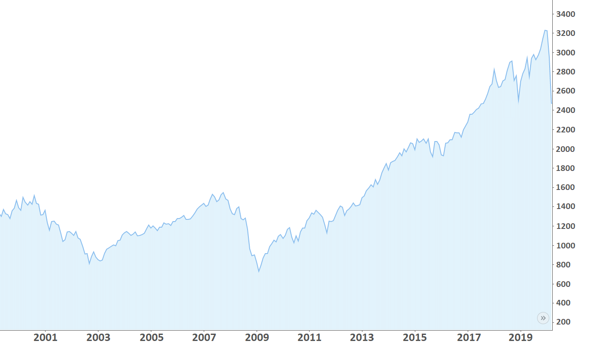

Neutralization
--------------

  Давайте проанализируем показатели акций 500 самых крупных компаний,
котирующихся на фондовых биржах США. Так называемый индекс S&P500 (рис. 1). Видно,
что в среднем рынок растёт. Доход S&P500 сильно варьируется от
нескольких процентов до более чем 20% для некоторых
[годов](https://www.cnbc.com/2017/06/18/the-sp-500-has-already-met-its-average-return-for-a-full-year.html).
Значит ли это, что просто держать длинные позиции хорошая идея?

_Рис.1_

Несмотря на рост S&P500, его Sharpe ratio менее 1. Одна из главных
причин - периодические финансовые кризисы. Вот некоторые из них:

-   1987 год. «Черный понедельник». Индекс Dow Jones упал на 22,6%.
    Причина - массовый отток инвесторов с региональных рынков.

-   2000-2003. Крах доткомов. Кризис вызван массовым вложением денег в
    интернет-проекты.

-   2007--2008. Мировой экономический кризис. Начался с ипотечного
    кризиса в США, банкротства банков и падения цен на акции, проложив
    путь мировому экономическому кризису (иногда называемому «великой
    рецессией»)

  Последствия кризисов видны на графике S&P 500 и проявляются в падении
рынка до 30%. Наивно думать, что кризис это страшные истории из
прошлого. Начало 2020 года ознаменовалось падением экономики, вызванным
коронавирусом.

Мы можем исключить влияние рынка, если уравновесим длинные и короткие
позиции для нашего алгоритма. Таким образом, суммарные инвестиции в
рынок составят $0. Нейтрализация может быть сделана для всего рынка или
для каждого сектора экономики отдельно (в целом для любой группы).
Математическая формулировка нейтрализации крайне проста.

Допустим алгоритм определил вектор весов **weightsi** для i-ого дня.
Для того что бы сделать алгоритм нейтральным относительно всего рынка
(market-neutral), достаточно изменить веса алгоритма следующим образом:

**neutralized\_weightsi** = **weightsi** - mean(**weightsi**).

Теперь среднее вектора весов для каждого дня равно нулю. Это означает,
что мы не вкладываем деньги и не выводим их с рынка.