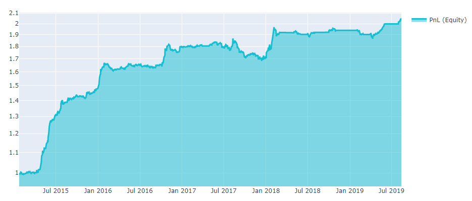

# Относительная доходность


## Основная информация
Инвестиционный портфель перераспределяется согласно алгоритму один раз в
день (у биржи примерно 252 рабочих дня в году). Перераспределение
происходит в начале дня. Для нашей платформы мы предполагаем, что
покупка акций происходит по цене открытия биржи (*open*).

Капитал растет, если прогноз изменения цен был верен. Ежедневное
изменение капитала оценивается в конце торгового дня и сильно зависит от
цены *close*. *Close* - цена, по которой ценные бумаги в последний раз
торговались в конкретный день.


Результаты алгоритма, рассчитанные на исторических данных, обычно
представляют на графике (рис. 1), чтобы понять поведение совокупной прибыли (equity).
В нашей платформе мы устанавливаем начальный капитал равным 1, чтобы его
можно было легко масштабировать на начальный капитал.


_Рис. 1_


Относительная доходность (relative returns) просто показывает как
изменился капитал. Для i-ого дня мы вводим относительную доходность (rr)
в долях единицы:

```math
\label{equity1}
    \text{rr}[i] = \frac{\text{equity}[i]}{\text{equity}[i-1]} - 1,
```

## Детали

Иногда важно понять, как рассчитывается совокупная прибыль (equity,
PnL). Скажем, мы распределяем наш капитал пропорционально вектору
*weights* для i-ого дня. Таким образом, мы покупаем акции по цене *open*
и получаем следующие позиции:

```math
\label{position}
    \textbf{pos}[i] = \left( \textbf{weights}[i]\cdot\text{equity}[i] \right)/\textbf{open}[i],
```

где переменные, выделенные жирным шрифтом, это вектора с весами для
каждого инструмента в портфеле; деление производится поэлементно. На
следующий день алгоритм сгенерирует новый вектор ``$` \textit{weigths}[i + 1] `$``,
который перераспределит наш капитал на новые
позиции. Перераспределение инструментов портфеля приводит к потерям
капитала, связанным, главным образом, с комиссией брокера и
проскальзыванием (*slippage*).

Совершенно очевидно, что чем большую часть капитала мы должны
перераспределить, тем больше комиссия брокера влияет на нашу прибыль.
Однако для реальной торговли проскальзывание оказывает более
существенное влияние на прибыль, чем комиссия, поэтому в нашей платформе
мы учитываем только проскальзывание.

Что такое проскальзывание? Для покупки/продажи акций нужен
продавец/покупатель. Если на бирже нет предложения, ордер открывается по
новой цене. Таким образом, мы покупаем нужное количество акций по
частям, используя предложения о покупке/продаже определенного количества
акций по определенной (изменяющейся) цене. Мы вычисляем проскальзывание
(*slippage*) по следующей формуле:

```math
\label{slappage}
    \text{slippage}[i] = abs(\textbf{pos}[i] - \textbf{pos}[i-1])\cdot \textbf{ATR}(14) \cdot 0.05,
```
где ``$` \textbf{ATR}(14) `$`` - индикатор волатильности рынка. Индикатор
Average True Range (``$` \textbf{ATR}(N) `$``) представляет собой скользящую
среднюю (MA) значений истинного диапазона (**TR**) за N дней:

```math
\begin{gathered}
\label{ATR}
    \textbf{TR}[i] = max(
\textbf{high}[i] - \textbf{low}[i]; \textbf{high}[i] - \textbf{close}[i-1]; \textbf{close}[i-1] - \textbf{low}[i]), \end{gathered}
```

```math
\label{ATR2}
    \textbf{ATR}(N) = MA(\textbf{TR},N).
```

Теперь мы можем ввести формулу расчета капитала для i-ого дня:
```math
\begin{gathered}
    \text{equity}[i] = \text{equity}[i - 1] + (\textbf{open}[i] - \textbf{close}[i-1]) \cdot \\ \textbf{pos}[i-1] + (\textbf{close}[i] - \textbf{open}[i]) \cdot \textbf{pos}[i] - \text{slippage}[i]
    \label{equity}\end{gathered}
```